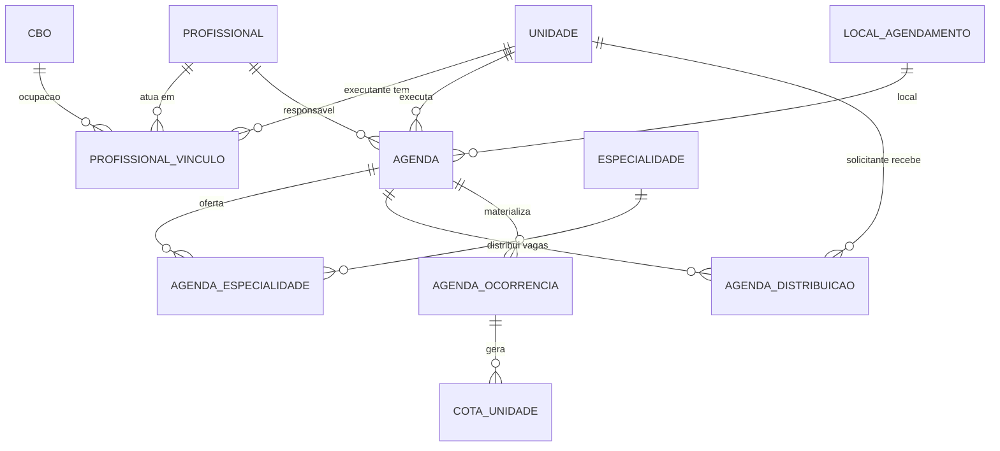

# Agenda e Oferta

> [!info] Nota escrita à mão
> Esta nota **não** é gerada por `docs/_build/gerar_vault.py` e não será sobrescrita.
> Fonte do pedido: ofício da Central de Regulação de São Felipe, 25/09/2026, mais três telas
> de referência enviadas pela coordenação (importação de profissionais do CNES, cadastro de
> estabelecimento e tela de escala/oferta).

## 1. O problema

Hoje o SIRG **não tem o conceito de agenda**. O que existe é cota: `CotaUnidade` limita quantas
marcações uma unidade (ou grupo) pode fazer num período — ver [[Mapa - Domínio]]. Quando a
coordenação diz "abrir agenda", na prática ela cadastra cotas: uma por unidade, uma por
especialidade, repetindo os mesmos dados todo mês.

Disso vêm as três dores do ofício:

1. **Repetição** — abrir a agenda mensal do laboratório exige cadastrar dezenas de cotas à mão.
2. **Falta de contexto** — a cota não sabe *onde*, *quando*, *com quem* nem *em que horário* o
   atendimento acontece. Essa informação só aparece depois, solta, no `AgendamentoSolicitacao`.
3. **Sem cadastro de executante** — não há onde registrar o prestador que realiza o atendimento
   nem quais profissionais atendem nele.

A proposta é criar a **Agenda** como a entidade que descreve a oferta (executante, profissional,
procedimento, datas, horário) e que **distribui vagas entre as unidades solicitantes**. A cota
continua sendo o motor de saldo — a agenda passa a alimentá-la.

## 2. O que o ofício pede, item a item

| Pedido da coordenação | Como é atendido |
|---|---|
| Cotas por unidade, com múltipla escolha | `AgendaDistribuicao`: N unidades por agenda, cada uma com sua quantidade de vagas |
| Local do atendimento | `Agenda.localAgendamento` (default: endereço do executante, sobrescrevível) |
| Procedimento individual **ou** em grupo | `Agenda.tipoOferta = INDIVIDUAL \| GRUPO` + `AgendaEspecialidade` (quais exames entram) |
| Profissional responsável | `Agenda.profissional`, filtrado pelos vinculados ao executante |
| Data única **ou** agenda mensal com vários dias | `vigenciaInicio/Fim` + `diasSemana` → materializa `AgendaOcorrencia` |
| Horário ou turno (preferência horário) | `horaInicial`/`horaFinal` na agenda; turno derivado para compatibilidade |
| Quantidade de vagas por unidade | `AgendaDistribuicao.vagasPorOcorrencia` |
| Cadastro de estabelecimento executante com CNES | `Unidade` estendida com tipo + dados cadastrais, preenchida pela API do CNES |
| Vincular profissionais ao estabelecimento | `ProfissionalVinculo` (profissional × executante × CBO) |

## 3. Decisões de arquitetura

> [!note] Decisões tomadas em 25/09/2026 — valem como premissa da implementação.

### 3.1 Estabelecimento executante estende `Unidade` (não é entidade nova)

`Unidade` ganha `tipo` (`SOLICITANTE`, `EXECUTANTE`, `AMBOS`) e os campos cadastrais que faltam.

**Por quê:** cotas, filas, dashboards, relatórios e o escopo de acesso por unidade
(ver [[Mapa - Segurança e Acesso]]) já filtram por `Unidade`. Uma entidade paralela obrigaria a
duplicar essa lógica inteira. O custo é uma tabela que mistura USF e prestador — mitigado pelo
campo `tipo`, que filtra cada combo na interface.

### 3.2 A agenda **gera** cotas por data

Ao materializar uma agenda, cada par (ocorrência × unidade) vira uma `CotaUnidade` com
`tipoPeriodo = DATA`, `dataEspecifica` igual à data da ocorrência e vínculo de volta para a agenda.

**Por quê:** o motor de consumo, estorno e *optimistic locking* (`@Version`) de `CotaUnidade` já
está em produção e testado. Reescrevê-lo dentro da agenda duplicaria a regra mais sensível do
sistema e criaria dois números de saldo para reconciliar. A cota **mensal** continua existindo e
funciona como teto independente.

### 3.3 Horário é faixa + vagas, não slot por paciente

A agenda tem `horaInicial` e `horaFinal`; a vaga não carrega horário individual.
`minutosPorAtendimento` entra no modelo **nulo**, preparado para a fase 2.

**Por quê:** é o que o ofício pede ("horário ou turno, preferência horário"). Slots individuais
mudariam a marcação, o comprovante impresso e os relatórios de produção — escopo próprio.

### 3.4 Regras de negócio aprovadas

| # | Regra |
|---|---|
| R1 | Vaga não usada **não** vaza entre unidades. Sobra só é reaproveitada por remanejamento manual do regulador. |
| R2 | Agenda mensal materializa as datas na criação. Editar a regra depois **não** altera ocorrência que já tem marcação. |
| R3 | Reduzir vagas abaixo do já consumido é bloqueado. Cancelar agenda com marcações exige realocar antes. |
| R4 | `reservaRegulador` é saldo **sem dono**: fica na central e o regulador aloca na hora da marcação. O restante é distribuído às unidades solicitantes. |
| R5 | Abrem agenda: `ADMIN` e `GESTOR`. `ADMIN_UNIDADE` só enxerga a fatia da própria unidade. |
| R6 | Migração: toda `Unidade` existente vira `AMBOS` — nada quebra em produção. |
| R7 | Local do atendimento tem default do endereço do executante, com campo livre para sobrescrever (caso do laboratório). |
| R8 | Em agenda de grupo, qualquer exame do grupo consome 1 do saldo único — é como `grupoEspecialidades` já funciona. |
| R9 | O mesmo profissional não pode ter duas agendas ativas com horário sobreposto na mesma data. Aviso bloqueante. |
| R10 | Cancelar uma ocorrência desativa as cotas geradas por ela e estorna o que não foi consumido. |

> [!note] Desvio da especificação, decidido na implementação (fase 2)
> A seção 4.2 previa **seed das ocupações do município** na V87. A tabela nasceu **vazia**:
> semear exigiria digitar códigos CBO à mão, e um código errado é pior que ausente — ele entra
> em silêncio no vínculo e passa a rotular o profissional com a ocupação de outra pessoa, sem
> nada que acuse o erro. A carga passa a vir de fonte confiável: o *upsert* por código da
> importação do CNES (dado do próprio DATASUS) ou `POST /api/cbos`.

## 4. Modelo de dados



### 4.1 `Unidade` — campos novos

| Campo | Tipo | Observação |
|---|---|---|
| `tipo` | enum `TipoUnidadeEnum` | `SOLICITANTE`, `EXECUTANTE`, `AMBOS`. Default `AMBOS` na migração (R6) |
| `cnpj` | varchar(14) | vem do CNES |
| `razaoSocial` | varchar(255) | vem do CNES |
| `nomeFantasia` | varchar(255) | vem do CNES |
| `bairro` | varchar(150) | vem do CNES |
| `cep` | varchar(8) | vem do CNES |
| `numero` | varchar(20) | vem do CNES |
| `email` | varchar(150) | vem do CNES |
| `sincronizadoCnesEm` | timestamp | quando os dados foram puxados da API |

`cnes` já existe e é `unique` — é a chave de sincronização.

### 4.2 `Cbo` — entidade nova

`codigo` (varchar(6), unique), `descricao` (varchar(255)), `ativo`.
Carga inicial via seed com as ocupações usadas no município; a tabela completa do CBO fica para
depois, se houver necessidade.

### 4.3 `ProfissionalVinculo` — entidade nova

Liga `profissional` × `unidade` (executante) × `cbo`, com `ativo`, `origem`
(`MANUAL` | `IMPORTACAO_CNES`) e `criadoEm`. Unique em (profissional, unidade, cbo).

> [!warning] `Profissional.unidade` fica obsoleto
> O campo atual é um `ManyToOne` único. A migração copia o valor existente para um
> `ProfissionalVinculo` com `cbo` nulo e `origem = MANUAL`, e o campo permanece na entidade
> marcado como `@Deprecated` até que os pontos de leitura sejam migrados — não remover na mesma
> migração, para não quebrar as telas atuais.

`Profissional` também ganha `cpf` (varchar(11), usado como chave na importação do CNES).

### 4.4 `Agenda` — entidade nova

| Campo | Tipo | Observação |
|---|---|---|
| `estabelecimentoExecutante` | FK `Unidade` | filtrado por `tipo IN (EXECUTANTE, AMBOS)` |
| `profissional` | FK `Profissional` | filtrado pelos vinculados ao executante |
| `cbo` | FK `Cbo` | opcional; sugerido a partir do vínculo |
| `localAgendamento` | FK `LocalAgendamento` | opcional (R7) |
| `localDescricao` | varchar(255) | texto livre que sobrescreve o endereço do executante |
| `tipoOferta` | enum | `INDIVIDUAL` \| `GRUPO` |
| `grupoEspecialidades` | FK `GrupoRelatorio` | preenchido quando `tipoOferta = GRUPO` |
| `vigenciaInicio` / `vigenciaFim` | date | data única = mesmo valor nos dois |
| `diasSemana` | varchar(20) | dias marcados, ex. `TER,QUI` |
| `horaInicial` / `horaFinal` | time | |
| `minutosPorAtendimento` | int null | **sempre nulo nesta fase** (3.3) |
| `reservaRegulador` | int | vagas sem dono por ocorrência (R4) |
| `observacao` | varchar(500) | |
| `ativo` | boolean | |
| `criadoPor` | FK `User` | |
| `version` | long | *optimistic locking* |

### 4.5 `AgendaEspecialidade`

`agenda` × `especialidade`. Numa agenda `INDIVIDUAL` há exatamente uma linha; numa agenda
`GRUPO` há N — exatamente os exames que a coordenação marcou, que podem ser um subconjunto do
grupo (o ofício pede "selecionar quais exames serão feitos").

### 4.6 `AgendaDistribuicao`

`agenda` × `unidadeSolicitante` × `vagasPorOcorrencia`. É o coração da "múltipla escolha de
unidades" do ofício.

### 4.7 `AgendaOcorrencia`

`agenda`, `data`, `horaInicial`, `horaFinal` (herdados e sobrescrevíveis), `status`
(`ABERTA` | `CANCELADA`), `version`. É a data concreta gerada pela expansão de
vigência × dias da semana (R2).

### 4.8 `CotaUnidade` — campos novos

| Campo | Tipo | Observação |
|---|---|---|
| `agendaOcorrencia` | FK null | quem gerou esta cota |
| `origem` | enum | `MANUAL` \| `AGENDA` |

Cota com `origem = AGENDA` **não** é editável na tela de cotas — edita-se a agenda.
As cotas manuais existentes recebem `origem = MANUAL` na migração e continuam funcionando como
sempre.

## 5. Integração com o CNES

> [!success] Testado ao vivo em 25/09/2026
> `GET https://apidadosabertos.saude.gov.br/cnes/estabelecimentos/{cnes}` responde **sem
> autenticação** e retorna todos os campos da tela de cadastro de estabelecimento.
> Verificado com o CNES `2514648` (Policlínica Municipal Dr. Antônio Albuquerque).

### 5.1 Estabelecimentos — automático

| Campo da API | Campo em `Unidade` |
|---|---|
| `codigo_cnes` | `cnes` |
| `nome_razao_social` | `razaoSocial` |
| `nome_fantasia` | `nome` / `nomeFantasia` |
| `numero_cnpj` **ou** `numero_cnpj_entidade` | `cnpj` |
| `endereco_estabelecimento` | `endereco` |
| `numero_estabelecimento` | `numero` |
| `bairro_estabelecimento` | `bairro` |
| `codigo_cep_estabelecimento` | `cep` |
| `numero_telefone_estabelecimento` | `telefone` |
| `endereco_email_estabelecimento` | `email` |

A chamada é feita **pelo backend** (nunca pelo browser), com timeout curto e degradação
silenciosa: se o CNES estiver fora do ar, o cadastro manual continua disponível.

> [!warning] Três armadilhas da API, descobertas testando
> 1. **O código IBGE do município tem 6 dígitos**, sem o dígito verificador. São Felipe é
>    `292910` (não `2929107`) e Conceição do Almeida é `290830`. Passar 7 dígitos devolve
>    **lista vazia com HTTP 200** — falha silenciosa, sem erro nenhum.
> 2. **O CNPJ vive em dois campos.** Consultório privado preenche `numero_cnpj`; unidade
>    pública preenche `numero_cnpj_entidade` (CNPJ da prefeitura mantenedora) e deixa o outro
>    nulo. Ler só um devolve nulo em metade dos casos.
> 3. **CNES inexistente responde 404**, não 200 com corpo vazio. Isso precisa virar 404 na
>    tela ("confira o número"), e não 503 ("serviço indisponível") — senão o operador fica
>    tentando de novo em vez de corrigir o que digitou.

### 5.2 Profissionais — importação por arquivo

> [!failure] Não existe endpoint público de profissionais
> Testados e todos 404: `/cnes/profissionais`, `/cnes/vinculos`, `/cnes/equipes`,
> `/cnes/ocupacoes`, as variantes com `/v1/` e o sub-recurso
> `/cnes/estabelecimentos/{cnes}/profissionais`. Os serviços internos de
> `cnes.datasus.gov.br` responderam 503.

A tela de importação é alimentada pelo CSV da
[Extração de dados de profissional](http://cnes.datasus.gov.br/pages/profissionais/extracao.jsp)
do próprio portal do CNES: a coordenação baixa o arquivo do estabelecimento e sobe no SIRG. Os
filtros da tela de referência (estabelecimento, CBO, CPF, nome) atuam sobre o conteúdo do
arquivo, e cada linha selecionada cria `Profissional` (se o CPF for novo) e
`ProfissionalVinculo` com `origem = IMPORTACAO_CNES`.

Caminho futuro: o webservice SOAP do CNES exige credencial solicitada formalmente pela SMS ao
DATASUS (via SCPA). Se ela for obtida, o import vira automático **sem mudar a tela** — troca-se
só o adaptador que alimenta a lista.

## 6. Telas

| Tela | Situação |
|---|---|
| Cadastro de estabelecimento executante | Nova. Campo CNES com busca que preenche o resto (5.1) |
| Importação de profissionais do CNES | Nova. Upload do CSV + filtros + seleção em lote (5.2) |
| Abertura de agenda | Nova. Executante → profissional → procedimento (individual/grupo) → vigência e dias → horário → distribuição de vagas por unidade + reserva do regulador |
| Listagem e edição de agendas | Nova. Inclui cancelar ocorrência e remanejar vagas (R1, R10) |
| Cotas | Ajuste: coluna de origem; cota de agenda entra somente-leitura com link para a agenda |
| Profissionais | Ajuste: CPF, vínculos múltiplos com CBO |
| Unidades | Ajuste: campo tipo e novos dados cadastrais |

## 7. Endpoints propostos

```
GET    /agendas                        lista, com filtros de executante, profissional, periodo
POST   /agendas                        cria e materializa as ocorrencias
GET    /agendas/{id}                   detalhe com ocorrencias e distribuicao
PUT    /agendas/{id}                   edita (R2, R3)
DELETE /agendas/{id}                   desativa (R3)
POST   /agendas/{id}/ocorrencias/{oid}/cancelar    (R10)
POST   /agendas/{id}/remanejar         move vagas entre unidades (R1)
GET    /cnes/estabelecimentos/{cnes}   proxy do backend para a API do DATASUS
GET    /cnes/estabelecimentos?municipio=  autocomplete
POST   /profissionais/importar-cnes    upload do CSV, devolve o que foi lido para conferencia
GET    /cbos                           lista para os combos
```

## 8. Migrações Flyway

A última migração em `main` é a `V85`. As novas seguem a partir da `V86`:

| Versão | Conteúdo |
|---|---|
| `V86` | `Unidade`: coluna `tipo` (default `AMBOS`) e dados cadastrais do CNES |
| `V87` | Tabela `cbo` + seed das ocupações do município |
| `V88` | Tabela `profissional_vinculo` + `profissional.cpf` + cópia de `profissional.unidade` |
| `V89` | Tabelas `agenda`, `agenda_especialidade`, `agenda_distribuicao`, `agenda_ocorrencia` |
| `V90` | `cota_unidade`: `agenda_ocorrencia_id` e `origem` (backfill `MANUAL`) |

## 9. Fases de entrega

1. ✅ **Cadastro (backend)** — `Unidade.tipo` + dados do CNES + busca por CNES (V86).
   Migração V1→V86 aplicada e validada em banco limpo; aplicação sobe com
   `ddl-auto=validate`; endpoints testados de ponta a ponta contra o DATASUS real.
   Falta a tela (fase 4).
2. ✅ **Profissionais (backend)** — CBO, vínculos, importação por CSV (V87, V88).
   Tabela `cbo` **sem seed** (decisão nova, ver abaixo), `profissional.cpf`,
   `profissional_vinculo` com backfill do campo antigo, importação em duas etapas
   (prévia sem gravar → confirmação idempotente) e `GET /profissionais/executante/{id}/ativos`,
   que é o combo que a fase 3 vai consumir. 21 testes unitários novos; migrações V1→V88
   validadas em banco limpo com `ddl-auto=validate` e comportamento conferido em SQL.
   Falta a tela (fase 4).
3. ✅ **Agenda (backend)** — modelo (`Agenda`, `AgendaEspecialidade`, `AgendaDistribuicao`,
   `AgendaOcorrencia`), materialização de ocorrências, R1–R3 e R6–R10, geração de
   `CotaUnidade` com `origem = AGENDA` (V89, V90). Ver
   [[0001-agenda-alimenta-cota-acesso-admin-tela-propria]] para os desvios desta fase:
   **R4 (`reservaRegulador`) ficou fora desta entrega** — o modelo de `CotaUnidade` exige
   exatamente um titular e a especificação não detalhava como representar saldo sem dono
   sem violar essa regra; e **R5 foi restringida**: acesso só para `ADMIN` (não `GESTOR`
   nem `ADMIN_UNIDADE`), decisão explícita do usuário.
4. ✅ **Telas** — abertura de agenda (`/liberacao-agenda/nova`), listagem e detalhe
   (`/liberacao-agenda`, cancelar ocorrência, remanejar vagas), cota com coluna de origem e
   tela própria para criar/editar (`/admin/cotas/nova`, `/admin/cotas/{id}/editar`, modal
   removido). O módulo saiu do Painel Admin, com item de menu próprio "Liberação de Agenda".
   Fase 4 de **Profissionais e Unidades** (busca CNES/CPF/vínculo direto na UI) não entrou
   nesta entrega — ficou combinado como pedido separado.

## 10. Fora de escopo nesta entrega

- Slots individuais por minuto (decisão 3.3) — modelo já preparado.
- Integração automática de profissionais via SOAP do CNES (5.2) — depende de credencial da SMS.
- Tabela completa do CBO — só as ocupações em uso.
- "Quebra automática" e "agenda local" que aparecem na tela de referência: não foram pedidas no
  ofício e não têm equivalente no fluxo do SIRG.

---

Volta para [[Início]] · vizinhos: [[Mapa - Domínio]], [[03 - Entidades e Classes de Domínio]], [[06 - Banco de Dados]]
